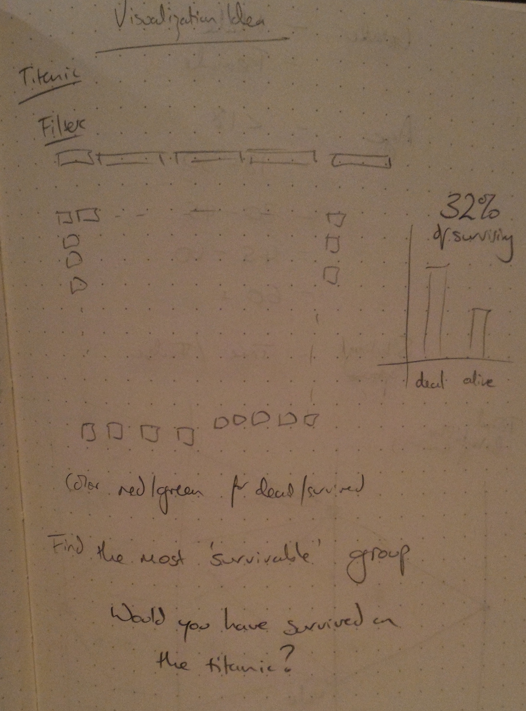
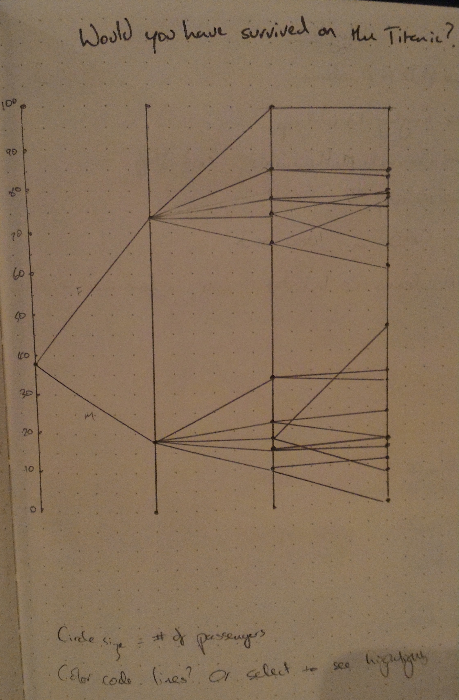

#Would you have survived on the Titanic? 

A visualization by David Wilson. 

The visualization can be viewed interactively on its [bl.ocks.org page](http://bl.ocks.org/Davidjohnwilson/raw/beb21c7b18d6a22ded78/).

###Summary

<!-- Summary - in no more than 4 sentences, briefly introduce your data visualization and add any context that can help readers understand it -->

This visualization is intended to show a user which groups were most and least likely to survive the Titanic, and then allow the user to see they're survival chances. The visualization splits passengers by gender and age, showing clearly that gender was a major factor in survivability. 

###Design

<!-- Design - explain any design choices you made including changes to the visualization after collecting feedback -->

Initially, I decided on a visualization that showed a circle for every passenger in the data set, colored according to if they survived or not. This would then be filterable so users could see the relative survivability of various classes. However, after implementing (see `dot_chart.html`) I realized that although visually interesting, it was very hard to actually compare any classes.

I therefore decided on a slope chart, to try and clearly show how the segmentation of the passengers by gender, age, and sibling/spouse affects survivability. As well as showing the changes in survivability, I also used the size of the circle at each node to show the number of passengers in each class.

In particular, I wanted it to be clear that female passengers unanimously had better survivability than male passengers. As part of this, I wanted to highlight the class with 100% survivability (Female, 60+, No Sibling/Spouse) and the class with 0% survivability (Male, 60+, No Sibling/Spouse).

I highlighted the slopes corresponding to these classes in blue and red (blue having a positive connotation, red having a negative connotation). I also removed the scale values for all but the leftmost axis to avoid chart junk. I added labels to each axis, and to the two highlighted classes.

To add interaction, I allowed users to hover over paths to highlight them in green (which would show the changes in survivability). Hovering over a node would also highlight that node in green, as well as showing a tooltip. The tooltip allows for full detail of the data: the number of passengers, exact survivability rate, and which classes the group of passengers belongs to. I initially played with highlighting or labelling the groups according to the classes they belong to, however I feel it just added extra chart junk.

###Feedback

<!-- Feedback - include all feedback you received from others on your visualization from the first sketch to the final visualization-->

Feedback was collected through this Google Form: [Form](https://docs.google.com/forms/d/1JM7kqiOV1nOZzfnkoC2_QB4Nkv0dSJ73jujjesDxdFs/viewform?usp=send_form). The responses can be seen here: [Responses](https://docs.google.com/forms/d/1JM7kqiOV1nOZzfnkoC2_QB4Nkv0dSJ73jujjesDxdFs/viewanalytics) (note that if the responses cannot be viewed, submitting a blank form will provide a link to the analytics after the final question).

The respondants pointed out that the initial version of the graphic was confusing to understand. In particular, the relationship between each axis was unclear (especially the last two axes) and at least one reviewer thought the graph should be read from right to left. 

I realised that I was trying to show too much on a single graph, so I decided to remove the Sibling/Spouse filtering from the visualization. This left a male/female split that then leads to an age split. The fact that the main relationship my reviewers inferred was the male/female split (and they explicitly said they did not understand the relationship between Sibling Spouse) suggests that removing this filter will not harm the value of the graphic - in fact by removing something that is unclear it will hopefully increase the value of the graphic.

Cutting down the filtering so much allows for a much cleaner graphic. The pared down filtering also allowed me to make the visualization 'portrait' rather than 'landscape', moving the explanation text to the right. Having longer axes accentuates the relationships and separates the data points more clearly.

The smaller set of data and new shape also allows for labels on each node without too much chart junk. Hopefully this alleviates the misunderstanding of the fact the ages split the gender, not the ridership directly.

The improved graphic is shown in `index_3.html`. Informal feedback from the initial reviewers suggest this visualization is much clearer and more interesting.

###Resources

<!-- Resources - list any sources you consulted to create your visualization -->

[Interactive Data Visualization for the Web by Scott Murray](http://chimera.labs.oreilly.com/books/1230000000345) - example code adapted to make tooltips.

I liked the styling of this [visualization](http://bl.ocks.org/lemahdi/raw/0d4c9f42c467dadc52ed/) that was posted on the Nanodegree group on Google+ so I tried to emulate some of it. 
